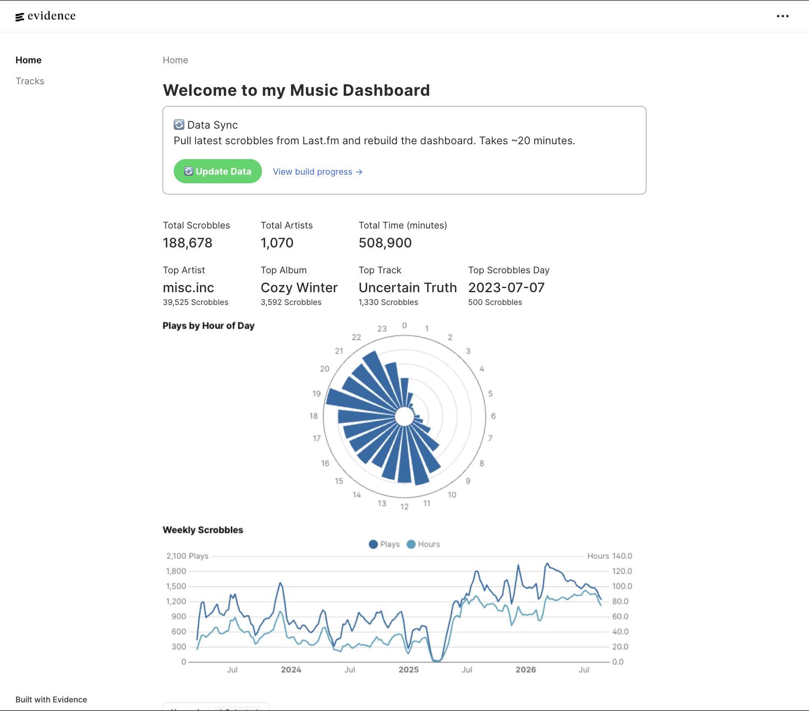
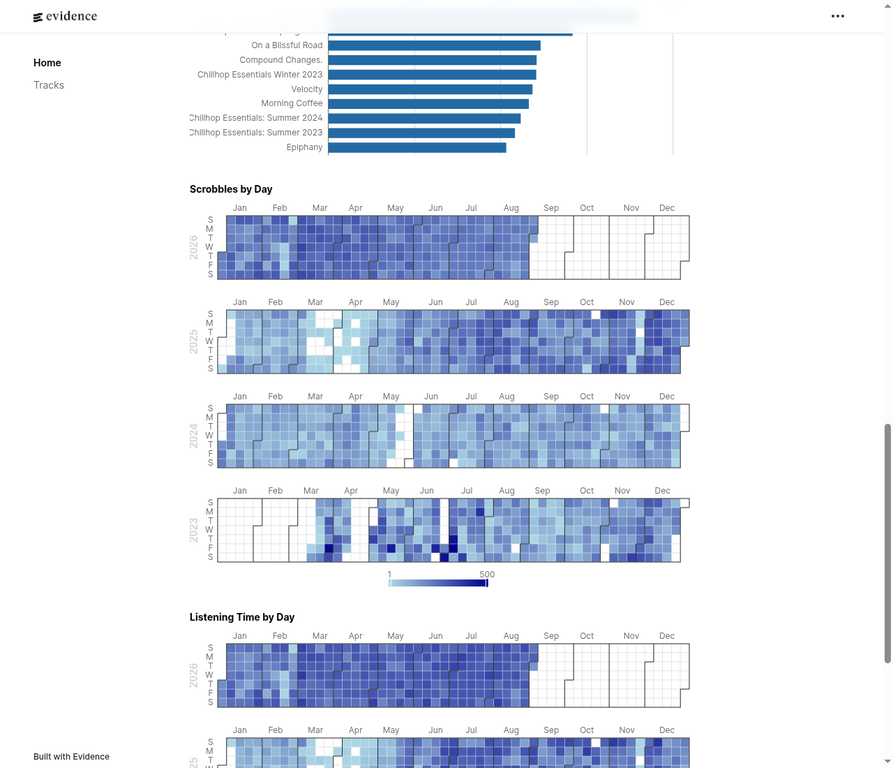
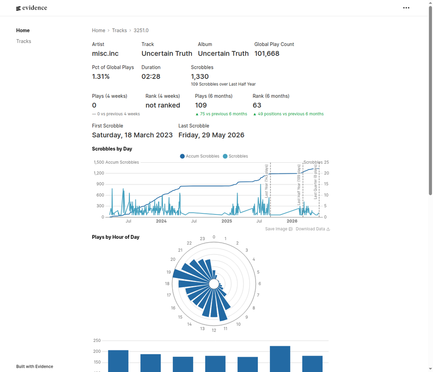

# ScrobbleScope (A Last.fm Listening History Dashboard)

> An automated analytics dashboard that turns personal Last.fm listening history into an interactive, queryable music intelligence product.

<p align="center">
  <a href="https://npn26.github.io/ScrobbleScope/">Live dashboard</a> ·
  <a href="https://github.com/NPN26/ScrobbleScope/actions">Build history</a> ·
  <a href="music-dashboard/pages/index.md">Dashboard source</a>
</p>

## What this project is About

This project is an end-to-end analytics workflow: Last.fm data is fetched incrementally, normalized into a relational DuckDB warehouse, transformed through SQL, and published as an interactive Evidence dashboard through GitHub Actions.

The result is a self-updating product for exploring **189K+ scrobbles**, **1K+ artists**, listening volume over time, top tracks and albums, hourly listening behavior, and year-level trends. The figures shown below are captured from the deployed dashboard and will change as new scrobbles are ingested.

## Dashboard preview

### Overview and polar listening profile

The dashboard combines headline KPIs with ranked artists, tracks, and albums. The polar bar chart makes the distribution of listening across the 24 hours of the day immediately legible while preserving a compact, presentation-ready visual form.



### Calendar heatmaps

Calendar heatmaps expose seasonality and listening consistency at a glance. The dashboard includes both **scrobbles by day** and **listening time by day**, with year filters for drilling into individual periods.



[Open the live dashboard →](https://npn26.github.io/ScrobbleScope/)

### Track-level exploration

The [`Tracks` page](https://npn26.github.io/ScrobbleScope/tracks/) turns the ranked catalog into a drill-down experience. Visitors can search and paginate through all tracks, then open a track detail view with metadata, lifetime scrobbles, recent-period play counts and rank movement, first/last scrobble dates, daily history, hourly listening patterns, album context, and similar tracks.



The track page is powered by two dedicated SQL models:

| SQL model | Responsibility |
| --- | --- |
| [`track_details.sql`](music-dashboard/sources/music/track_details.sql) | Calculates the selected track’s metadata and lifetime/recent scrobble metrics used by the detail header and KPI cards. |
| [`track_ranks.sql`](music-dashboard/sources/music/track_ranks.sql) | Compares the track across the last four weeks and six months, calculating play-count deltas, ranks, rank movement, and statuses such as `new entry`, `improved`, or `declined`. |

Together, these models keep the page’s business logic in SQL while the Evidence page focuses on presenting the resulting metrics and visual analyses.

## Architecture

The system is designed as a small, reproducible data product with the repository acting as both source code and the versioned data handoff between the ingestion and publishing stages.


### How an update works

1. A push to `main` or a manual workflow dispatch starts `.github/workflows/deploy.yml`.
2. The workflow installs Python dependencies and runs `python extract.py NP26` with `LASTFM_API_KEY` supplied through GitHub Secrets.
3. `extract.py` reads the latest stored scrobble timestamp from DuckDB and requests only the newer Last.fm history. The API client uses pagination, rate-limit spacing, and retry logic so transient Last.fm failures do not silently invalidate the refresh.
4. New artists and tracks are resolved into dimension tables. Track metadata such as album, duration, and global playcount is enriched through `track.getInfo`; duplicate artists, tracks, and scrobbles are protected by database uniqueness constraints.
5. New listening events are inserted into `music-dashboard/sources/music/warehouse.duckdb`. The workflow commits the changed warehouse back to the repository when there is a data change.
6. Evidence runs its source queries against DuckDB, builds the static dashboard, uploads the build artifact, and deploys it to GitHub Pages.

This separation keeps ingestion, storage, analytical SQL, and presentation independently understandable while allowing the complete refresh to run from a clean GitHub-hosted runner.

## Data model

| Table | Purpose | Key fields |
| --- | --- | --- |
| `artists` | Deduplicated artist dimension | `id`, `name` |
| `tracks` | Track-level metadata linked to artists | `id`, `artist_id`, `name`, `album_name`, `duration_ms`, `global_playcount` |
| `scrobbles` | Timestamped listening events | `id`, `track_id`, `timestamp`, `is_loved` |

## What the dashboard answers

The dashboard is built for exploratory questions rather than a single static report. It surfaces total scrobbles, unique artists, total listening time, top artists, albums, tracks, peak listening days, weekly trends, hourly patterns, annual rankings, and calendar-level activity. The year selector allows the same metrics and visualizations to be compared across listening eras.

## Repository map

| Path | Role |
| --- | --- |
| [`extract.py`](extract.py) | Incremental Last.fm ingestion, metadata enrichment, and DuckDB writes |
| [`lastfm.py`](lastfm.py) | Last.fm API request helper |
| [`music-dashboard/pages/index.md`](music-dashboard/pages/index.md) | Main Evidence dashboard page and analytical SQL |
| [`music-dashboard/pages/tracks/[track].md`](music-dashboard/pages/tracks/[track].md) | Track-level detail page |
| [`music-dashboard/sources/music/`](music-dashboard/sources/music/) | DuckDB source and Evidence query definitions, including the track detail/ranking models |
| [`.github/workflows/deploy.yml`](.github/workflows/deploy.yml) | Automated refresh, build, and GitHub Pages deployment |
| [`music_analysis.ipynb`](music_analysis.ipynb) | Original exploratory notebook for Spotify export analysis |
| [`docs/assets/`](docs/assets/) | README dashboard screenshots for the overview, heatmaps, and Tracks page |

## Run it locally

The automated dashboard build requires Python, Node.js, DuckDB, and the Evidence CLI dependencies.

```bash
git clone https://github.com/NPN26/ScrobbleScope.git
cd ScrobbleScope

# Install ingestion dependencies
pip install -r requirements.txt

# Install dashboard dependencies
cd music-dashboard
npm install
npm run sources
npm run dev
```

To refresh data locally, provide a Last.fm API key and run the extractor with a Last.fm username:

```bash
export LASTFM_API_KEY="your-lastfm-api-key"
cd ..
python extract.py NP26
```

The dashboard is intentionally published as a static site, so the public experience does not require a running backend. The **Update Data** control in the dashboard triggers the GitHub Actions workflow through the GitHub API and is intended for authorized repository users.

## Privacy

Listening history can contain sensitive behavioral metadata. The raw warehouse and exported history are personal data; review the repository visibility, GitHub Pages settings, and API secrets before adapting this workflow for another account.

## References

[1]: https://www.last.fm/api/show/user.getRecentTracks "Last.fm user.getRecentTracks API"
[2]: https://www.last.fm/api/show/track.getInfo "Last.fm track.getInfo API"
[3]: https://docs.github.com/en/actions "GitHub Actions documentation"
[4]: https://duckdb.org/docs/ "DuckDB documentation"
[5]: https://docs.evidence.dev/ "Evidence documentation"
[6]: https://docs.github.com/en/pages "GitHub Pages documentation"

The implementation uses the Last.fm endpoints, GitHub Actions, DuckDB, Evidence, and GitHub Pages described in the linked documentation.[1] [2] [3] [4] [5] [6]
